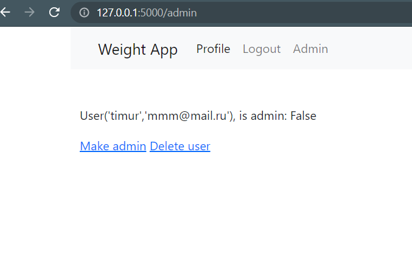
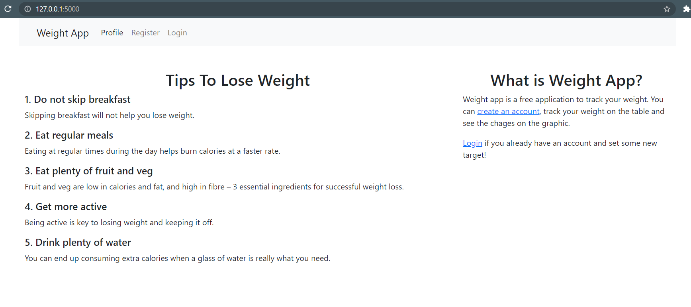
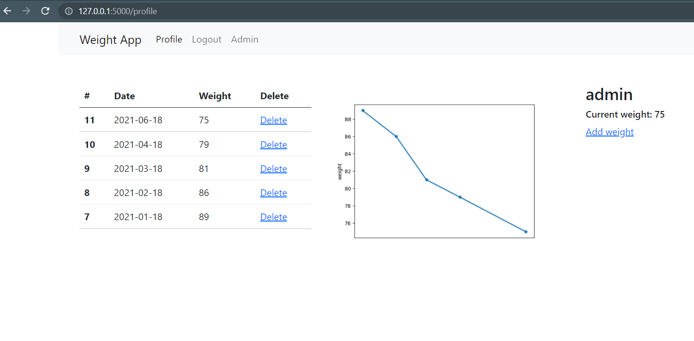
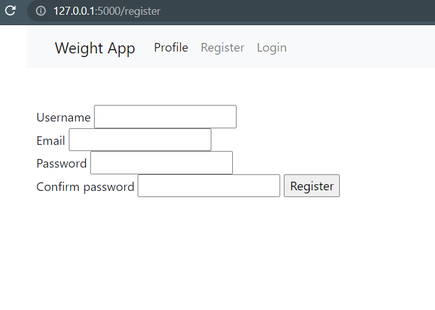

# Project Name
> Weight App to show a table of lossing weight and a small png graphic

## Table of Contents
* [General Info](#general-information)
* [Features](#features)
* [Screenshots](#screenshots)
* [Setup](#setup)
* [Usage](#usage)
* [Project Status](#project-status)
* [Contact](#contact)

## General Information
- It's easy to lose weoght when
- it's my first project on github

## Features
- Admin panel - to delete users and make/unmake them admins
Created @administrator decorator to check whether the user is admin or not
- Database is SQLite 
SQLAlchemy to access the database, one to many relationship (user -> weights)
- matplotlib to create and save .png graphic every time user goes to profile page

## Screenshots

## Setup
The requirements are in requirement.txt
Once the app is started, admin user automatically created using enviromental variable
YOU MUST FIRST SET UP ENVIROMENTAL VARIABLES 'ADMIN_PASSWORD' and 'ADMIN_EMAIL'
OR USE 'admin@email.com' as login, 'password' as password if not set.
username is admin, cannot be deleted

## Usage
Once account is created, you can add weight and date (YEAR-MONTH-DAY)
Go to profile and check the table and graphic

## Project Status
Project is: _in progress_ 

## Contact
Created by [@AkhmetTimur](https://www.massomi@mail.ru/) - feel free to contact me!

